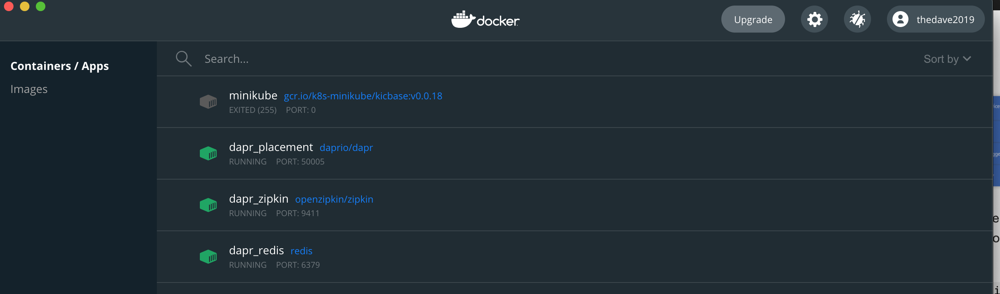

Microservice architecture is one of those buzz phrases in today's tech industry that stirs different opinions.  

Microservices allows your entire application to be decentralized and decoupled into smaller more manageable services. This process provides a high level of resiliency and durability because each service is independent of one another. This also allows for each service to be deployed separately and can even be be developed in different languages.

There are a few difficulties within the microservice paradigm, the first is the interaction between each each service. 

**Example**: _Service A_ makes https calls to _Service B_ 

Service A needs to be aware of Service B and know where the service resides within the system.

The second problem is developers having to worry about these interactions and also the underlying infrastructure they are interacting with (i.e., cluster and databases (state)).

To solve the above-mentioned issues...this is where _Dapr_ helps.

## What is Dapr and how does it help?

_Dapr_ which stands for _Distributed Application Runtime_ is a framework that allows developers to build reliable event driven microservice applications without the need to worry about interacting with infrastructure and keeps their code platform agnostic.

_Dapr_ prides itself on being “any language, any framework, run anywhere” meaning developers can code in any language of their choice, use any framework of their choice and deploy to anywhere.


<sup>_Above Image Referenced from https://dapr.io_</sup>

Application developers should be able to focus on developing business logic and not care about the underlying infrastructure that their application is running on. Dapr provides an agnostic platform with building blocks that offer best practices for developing microservices.

These building blocks provide mechanisms for swapping implementations in/out when deployment or architecture changes require it. Some changes may require swapping out the backend state stores or messaging platform, _Dapr_ provides a consistent mechanism for integrating with these various plugins via the _Dapr_ runtime which is deployed using the [_sidecar pattern_](https://docs.microsoft.com/en-us/azure/architecture/patterns/sidecar).

### What is the Dapr Sidecar?

The _Dapr sidecar_ is a separate service that is deployed side-by-side with your application using the [_sidecar pattern_](https://docs.microsoft.com/en-us/azure/architecture/patterns/sidecar) and it exposes all of the _Dapr_ runtime APIs. Which your application code then uses to make calls via http or grpc protocols. 


### Dapr Hosting Options

With the first GA release of _Dapr_ there are two hosting options available which are:
- Self-Hosted
- Kubernetes Hosted

#### Self-Hosted

<sup>_Above Image Referenced from https://dapr.io_</sup>

Within the self-hosted model, the core _Dapr_ services are run in a separate process on your local machine or VM. 

Running the command `dapr init` will configure the default setup in Docker.



This default setup contains the following docker containers:
* _Dapr Placement Service_
  * This service is responsible for a distributed hashing mechanism that distributes actors across service instances
* _Dapr Redis_
  * Redis is the default state store and pub/sub service
* _Dapr Zipkin_
  * Zipkin is the default monitoring and logging tool


#### Kubernetes Hosted

<sup>_Above Image Referenced from https://dapr.io_</sup>

Within the kubernetes hosted model the core _Dapr_ APIs are deploy in a separate container running in the same pod as your application code.

To setup _Dapr_ on a kubernetes cluster run the following command:

`dapr init -k`

The command will use the cluster specified in your current `kubectl` context.

You can also provision _Dapr_ into a specific kubernetes namespace by calling : `dapr init -k -n {namespace}`.

_Dapr_ can also be deployed into a cluster using _HELM_.

1. Make sure [HELM 3](https://github.com/helm/helm/releases) is installed on your machine.
2. Add the Dapr Helm repo
```
helm repo add dapr https://dapr.github.io/helm-charts/
helm repo update
# See which chart versions are available
helm search repo dapr --devel --versions
```
3. Install _Dapr_

```
helm upgrade --install dapr dapr/dapr \
--version=1.0.1 \
--namespace dapr-system \
--create-namespace \
--wait

```


### Dapr State Management

<sup>_Above Image Referenced from https://dapr.io_</sup>

When building stateful microservices you need to have the ability to store your application state in order to recover from failures, outages, and for overall useability beyond a single session. 

One of the foundational building blocks of _Dapr_ is _State Management_, which abstracts away the underlying state store from the application developer. It provides a key/value-based state API that allows for state store implementation to be swapped in and out.

These configurable state stores are added and updated via configuration files like the following examples:

Ex: Redis

```
apiVersion: dapr.io/v1alpha1
kind: Component
metadata:
  name: statestore
spec:
  type: state.redis
  metadata:
  - name: redisHost
    value: redis:6379
  - name: redisPassword
    value: ""
  - name: actorStateStore
    value: "true"
```

Ex: Cosmos DB

```
apiVersion: dapr.io/v1alpha1
kind: Component
metadata:
  name: app-statestore
spec:
  type: state.azure.cosmosdb
  version: v1
  metadata:
  - name: url
    value: https://dapr-poc.documents.azure.com:443/
  - name: masterKey
    value: _COSMOS_KEY_
  - name: database
    value: dapr-poc
  - name: collection
    value: dapr-state
```

On the Self-Hosted model, you can override the state store by specifying the location of the configuration files within the `-components-path` flag when running `dapr run ` command.

Ex: 

`dapr run --app-id my-app --components-path ./components`

State can be managed via [Dapr sdks](https://docs.dapr.io/developing-applications/sdks/#sdk-languages), or directly over http, like in the following GET request sample code below:

```
import requests
import json

store_name = "redis-store" # name of the state store as specified in state store component yaml file
dapr_state_url = "http://localhost:3500/v1.0/state/{}".format(store_name)
response = requests.get(dapr_state_url + "/key1", headers={"consistency":"strong"})
print(response.headers['ETag'])
```
### Actor Framework


<sup>_Above Image Referenced from https://dapr.io_</sup>

_Dapr_'s actor framework is based off similar patterns made popular in Microsoft offerings like [Service Fabric Reliable Actors](https://docs.microsoft.com/en-us/azure/service-fabric/service-fabric-reliable-actors-introduction) and [Orleans Virtual Actors](https://www.microsoft.com/en-us/research/project/orleans-virtual-actors/#:~:text=The%20main%20research%20paper%20that%20describes%20Orleans%20Virtual,the%20rapid%20development%20and%20updating%20of%20microservice-based%20applications.).

The actor pattern allows developers a way to encapsulate logic and data into a single self-contained unit (known as an actor) which can receive and process messages one at a time without a need for threading or concurrency. A system can have hundreds of actors running simultaneously and independently of each other.

As shown in the above diagram, the _App_ makes a request via the _Dapr_ runtime to the following url _http://localhost:3500/v1.0/actors/MyActors/A/method/update_. The _Dapr_ runtime will look up the location of the requested actor by making a request to the _Dapr Placement Service_ which returns the address 10.0.0.6:6004/update. Using the location returned from the _Dapr Placement Service_ the _Dapr_ runtime forwards the request on to complete the action.

The actor pattern is useful for scenarios like game engines which spawn different characters that have a limited lifespan; another good use case for the actor framework is what is illustrated in the diagram above. This use case is IoT devices where each actor would represent an IoT device/sensor.

Actors often need to persist their state in order to re-hydrate when it goes offline and changes its location. This is accomplished by enabling the following setting in the `metadata` of state store component:

```
name: actorStateStore
value: "true"
```

### Pub/Sub Pattern

Another essential pattern that _Dapr_ provides for building microservices is the _Pub/Sub_ building block. The _Publisher/Subscriber_ pattern allows the services to communicate via a messaging plane like _Azure Service Bus_ or _Kafka_.


<sup>_Above Image Referenced from https://dapr.io_</sup>

### Observability
Observability is a general term that hits both service monitoring and logging areas and _Dapr_ offers built-in integrations for tracing, metrics, and logging.

By default, in self-hosted mode _Dapr_ leverages [zipkin](https://zipkin.io/) for tracing, logging, and metrics but can easily be swapped out for other observability tools such as Azure Log Analytics, Prometheus, and ELK to name a few. This is done via the component's configuration:

```
apiVersion: dapr.io/v1alpha1 
kind:Configuration 
metadata: 
    name: daprConfigs 
    namespace: default 
    spec: 
        tracing: samplingRate: "1" 
        zipkin: 
            endpointAddress: "http://zipkin:9411/api/v2/spans"
```

These configurations can be overwritten when running the `dapr run` command locally in self-hosted mode or deployed to a kubernetes cluster through `kubectl` command deployments.


## My Thoughts/Next Steps

The above listed components are just a few of the essential components that _Dapr_ provides, but there are several others like _Secrets Management_ and _Service Invocation_ which you can find more info on at [dapr.io](https://dapr.io).

Overall, this platform seems promising. I will be doing a follow-up post which will put Dapr into action by building out a full microservice application in a similar vein as the [eShop Demo](https://docs.microsoft.com/en-us/dotnet/architecture/dapr-for-net-developers/reference-application).

Stay tuned!